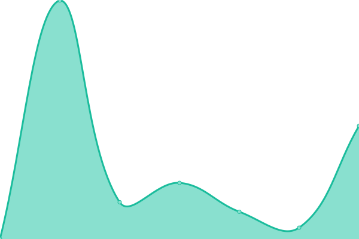
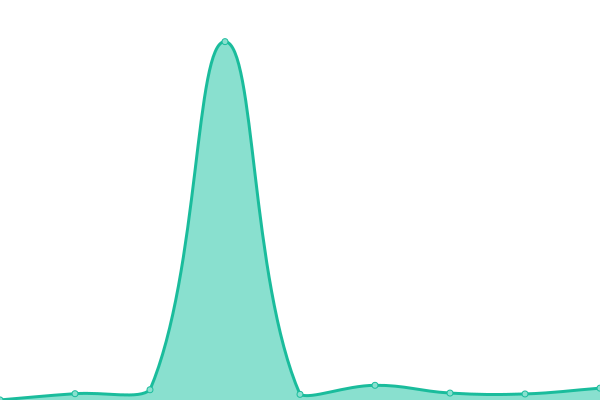

# [📈 Live Status](https://uptime.aoyans.dev): <!--live status--> **🟩 All systems operational**

This repository contains the open-source uptime monitor and status page for [PythonCoderAS](https://uptime.aoyans.dev), powered by [Upptime](https://github.com/upptime/upptime).

With [Upptime](https://upptime.js.org), you can get your own unlimited and free uptime monitor and status page, powered entirely by a GitHub repository. We use [Issues](https://github.com/PythonCoderAS/uptime/issues) as incident reports, [Actions](https://github.com/PythonCoderAS/uptime/actions) as uptime monitors, and [Pages](https://uptime.aoyans.dev) for the status page.

<!--start: status pages-->
<!-- This summary is generated by Upptime (https://github.com/upptime/upptime) -->
<!-- Do not edit this manually, your changes will be overwritten -->
<!-- prettier-ignore -->
| URL | Status | History | Response Time | Uptime |
| --- | ------ | ------- | ------------- | ------ |
|  [Grafana](https://grafana.aoyans.dev) | 🟩 Up | [grafana.yml](https://github.com/PythonCoderAS/uptime/commits/HEAD/history/grafana.yml) | 

 1339ms
     
 | 

<a href="https://uptime.aoyans.dev/history/grafana">100.00%</a>
    

|  [Jellyfin](https://jellyfin.aoyans.dev) | 🟩 Up | [jellyfin.yml](https://github.com/PythonCoderAS/uptime/commits/HEAD/history/jellyfin.yml) | 

 238ms
     
 | 

<a href="https://uptime.aoyans.dev/history/jellyfin">100.00%</a>
    

|  [Qbittorrent](https://qbittorrent.aoyans.dev) | 🟩 Up | [qbittorrent.yml](https://github.com/PythonCoderAS/uptime/commits/HEAD/history/qbittorrent.yml) | 

 322ms
     
 | 

<a href="https://uptime.aoyans.dev/history/qbittorrent">4.17%</a>
    

<!--end: status pages-->

[**Visit our status website →**](https://uptime.aoyans.dev)

## 📄 License

- Powered by: [Upptime](https://github.com/upptime/upptime)
- Code: [MIT](./LICENSE) © [PythonCoderAS](https://uptime.aoyans.dev)
- Data in the `./history` directory: [Open Database License](https://opendatacommons.org/licenses/odbl/1-0/)
